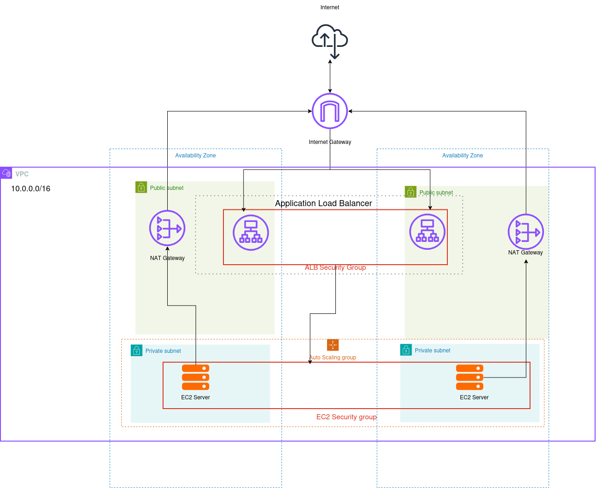

# AWS Web Application Infrastructure with Terraform

This project provisions a highly available, two-tier web application architecture on AWS using Terraform. It demonstrates infrastructure as code, modular design, remote state management, automated validation, plan review, and infrastructure drift detection.

The application is a read-only static website served by Python on EC2 instances. An internet-facing Application Load Balancer receives HTTP traffic and forwards it to an Auto Scaling group running in private subnets.

## Why Terraform?

Terraform provides a declarative and repeatable way to manage the infrastructure in this repository.

- **Reliability:** Terraform compares the desired configuration with the existing infrastructure before making changes. Multi-AZ networking, load-balancer health checks, and Auto Scaling improve application availability.
- **Scalability:** The Auto Scaling group adjusts capacity in response to the Application Load Balancer request count per target.
- **Reproducibility:** The same configuration can recreate the architecture consistently. Variables allow environment-specific values to change without duplicating resource definitions.
- **Maintainability:** Networking, load balancing, and compute resources are separated into reusable modules with clearly defined inputs and outputs.
- **Reviewability:** Terraform plans show proposed infrastructure changes before they are applied, allowing changes to be reviewed through GitHub Actions.

## Architecture



The infrastructure includes:

- One VPC spanning two Availability Zones.
- Two public subnets for the Application Load Balancer and NAT gateways.
- Two private subnets for EC2 application instances.
- An Internet Gateway and public route table for internet-facing resources.
- One NAT gateway per Availability Zone, allowing private instances to make outbound connections without accepting direct internet traffic.
- An Application Load Balancer that accepts HTTP traffic on port `80`.
- A target group that forwards requests to the application on port `8000` and monitors instance health.
- An Auto Scaling group with a default desired capacity of three instances, a minimum of two, and a maximum of four.
- Target-tracking scaling based on ALB requests per target.
- A launch template that selects the latest matching Ubuntu 24.04 AMI and uses IMDSv2.
- An existing EC2 instance profile named `EC2-SSM`, allowing administration through AWS Systems Manager Session Manager without SSH key pairs.

### Network security

The load balancer security group allows inbound HTTP traffic on port `80` and permits outbound traffic. The application security group allows inbound traffic on port `8000` only when the source is the load balancer security group. EC2 instances are placed in private subnets and do not accept direct inbound traffic from the internet.

This project currently uses HTTP rather than HTTPS. A production deployment should normally add an ACM certificate, an HTTPS listener, and an HTTP-to-HTTPS redirect.

### Instance access

No EC2 key pairs are created or attached to the application instances, and the application security group does not expose SSH port `22`. Administrative access is provided through AWS Systems Manager Session Manager using the existing `EC2-SSM` instance profile. This avoids distributing and managing long-lived SSH private keys while allowing authenticated and authorized sessions through AWS IAM.

## Application bootstrap

The EC2 launch template supplies a rendered user-data script when an instance starts. The script:

1. Installs Python 3 only when it is not already available.
2. Writes the static site from `templates/index.html` to `/var/www/html/index.html`.
3. Gives the `www-data` user read-only access to the site content.
4. Creates and starts a systemd service running Python's HTTP server on the configured application port.

The application port is controlled by one Terraform variable so that the security group, target group, and web server remain consistent.

## Remote state management

The `bootstrap/` configuration creates the S3 bucket used by the root configuration as its remote backend. The bucket includes:

- Versioning for recovery of earlier state-file versions.
- Server-side encryption with AWS KMS.
- S3 public-access blocking.
- Terraform lifecycle protection against accidental bucket deletion.

The root backend enables S3 state locking with `use_lockfile = true`. Locking prevents concurrent Terraform operations from modifying the same state at the same time.

Terraform state can contain sensitive infrastructure data and must never be committed to source control. This repository's `.gitignore` excludes state files, local `.tfvars` files, generated plan reports, and `.terraform/` working directories.

> The bootstrap configuration maintains its own state. Keep `bootstrap/terraform.tfstate` in a secure, backed-up location because it tracks the backend bucket itself.

## GitHub Actions

The repository contains two workflows under `.github/workflows/`.

### Terraform checks and plan

`terraform-pr.yaml` runs for relevant pull requests, pushes to `main`, and manual dispatches. It:

- Checks Terraform formatting.
- Initializes and validates both the root and bootstrap configurations.
- Authenticates to AWS using GitHub OIDC and an IAM role instead of long-lived AWS access keys.
- Creates a Terraform plan without applying it.
- Uploads the complete plan output as a short-lived workflow artifact.
- Adds a review comment to pull requests.
- Creates or updates a GitHub issue when a push to `main` introduces unapplied infrastructure changes.

Plans from forked pull requests do not receive AWS credentials. This prevents untrusted fork code from using the repository's OIDC permissions.

### Drift detection

`terraform-drift.yaml` runs only when manually dispatched from the GitHub Actions interface. It uses a refresh-only Terraform plan to compare the recorded state with the actual AWS resources, making it suitable for short-lived demonstration environments that do not require continuous scheduled monitoring.

When drift is found, the workflow uploads the report and creates or updates a GitHub issue for review. When the drift is resolved, the corresponding issue is closed. Workflow failures also generate an issue.

Neither workflow automatically runs `terraform apply`. Infrastructure changes must be reviewed and applied through an explicitly approved process.

## Repository structure

| Path | Purpose |
| --- | --- |
| `bootstrap/` | Creates and secures the S3 remote-state bucket |
| `modules/network/` | VPC, subnets, routing, Internet Gateway, and NAT gateways |
| `modules/load-balancer/` | ALB, listener, target group, and ALB security group |
| `modules/compute/` | EC2 security group, launch template, Auto Scaling group, and scaling policy |
| `templates/` | Static HTML content and the EC2 user-data template |
| `.github/workflows/` | Terraform validation, planning, and drift-detection automation |
| `main.tf` | Connects the root configuration to the Terraform modules |
| `variables.tf` | Root input variables and default values |
| `outputs.tf` | Useful deployment outputs, including the ALB DNS name |
| `backend.tf` | S3 backend and state-locking configuration |

## Prerequisites

- An AWS account and permission to create the resources in this project.
- Terraform compatible with the repository lock files. GitHub Actions currently uses Terraform `1.16.0`.
- AWS CLI authentication configured locally through a named profile.
- An existing EC2 IAM instance profile named `EC2-SSM` with Systems Manager permissions.
- An AWS IAM OIDC provider and GitHub Actions role for CI workflows.

GitHub Actions expects these repository variables:

| Variable | Description |
| --- | --- |
| `AWS_ROLE_ARN` | ARN of the IAM role trusted by the GitHub OIDC provider |
| `AWS_REGION` | AWS region used by the workflows, such as `us-east-2` |

## Deployment

### 1. Create the backend bucket

Create `bootstrap/terraform.tfvars` locally:

```hcl
aws_profile = "your-aws-profile"
bucket_name = "your-globally-unique-terraform-state-bucket"
```

Then provision the backend resources:

```bash
cd bootstrap
terraform init
terraform plan
terraform apply
cd ..
```

### 2. Configure the root deployment

Create `terraform.tfvars` locally with the same AWS profile:

```hcl
aws_profile = "your-aws-profile"
```

Other variables have defaults in `variables.tf` and can be overridden when needed.

### 3. Initialize and review

```bash
terraform init
terraform fmt -check -recursive
terraform validate
terraform plan
```

Review the complete plan before applying it:

```bash
terraform apply
```

After deployment, retrieve the public application endpoint with:

```bash
terraform output -raw alb_dns_name
```

### 4. Destroy application infrastructure

```bash
terraform destroy
```

The bootstrap bucket is protected with `prevent_destroy` and is managed separately from the application infrastructure.

## Cost considerations

This architecture creates billable AWS resources, including an Application Load Balancer, EC2 instances, NAT gateways, Elastic IP addresses, S3 storage, and data transfer. NAT gateways can produce ongoing charges even when application traffic is low. Run `terraform destroy` when the application environment is no longer needed, while preserving the remote state bucket as appropriate.

## Security notes

- Do not commit Terraform state, real `.tfvars` files, credentials, private keys, or generated plan output.
- Use GitHub OIDC rather than storing AWS access keys as GitHub secrets.
- Restrict the GitHub Actions IAM role to the repository, branch or environment, and permissions it requires.
- Review plan and drift artifacts before changing live infrastructure.
- Keep S3 Block Public Access enabled for the state bucket.
- Add HTTPS before using this architecture for production traffic.

## Scope

This repository is intended as an infrastructure demonstration and learning project. It provides a resilient web and application deployment pattern but does not include a database tier, application-level authentication, a custom domain, TLS termination, or production observability.
